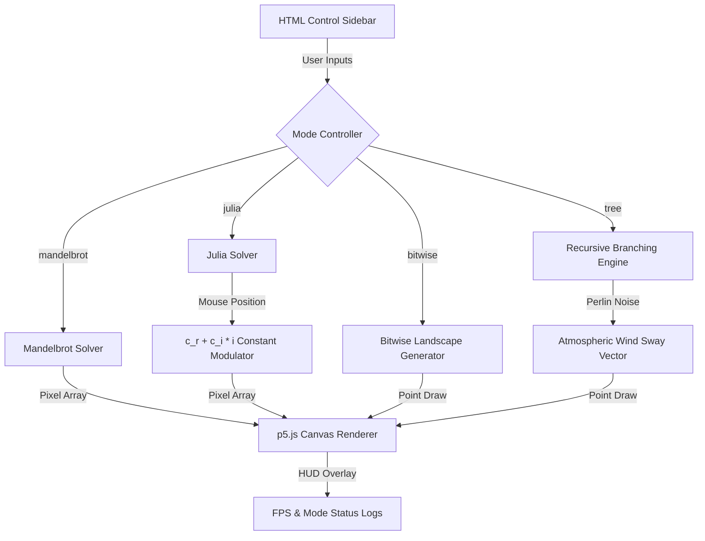

# Interactive Fractal & Chaos Theory Suite ❄️

A premium, interactive browser-based creative coding application built with **p5.js** to visualize self-similarity, recursive growth, and complex dynamics. 

Explore mathematical equations through organic animations, color maps, and boolean noise grids.

---

## 🚀 Interactive Modes

### 1. Bitwise Landscapes (Boolean Noise)
*   **Concepts**: Logic tables, boolean operations, self-similar bitwise patterns.
*   **Math**: 
    *   `Point_1 = (x | y, x & y)`
    *   `Point_2 = (x & y, x ^ y)`
*   **Visuals**: Reveals how simple boolean logic operations (AND, OR, XOR) produce structured rectangular grid landscapes and nested squares when mapped across coordinates.

### 2. Recursive Swaying Trees (Organic Growth)
*   **Concepts**: Recursion terminuses, branching geometry, Perlin noise vectors.
*   **Math**:
    *   `x_next = x + L · cos(θ + wind)`
    *   `y_next = y - L · sin(θ + wind)`
*   **Visuals**: A recursive tree that splits at every node. Adjust branch angle, length ratio, and tree depth. Features an organic **wind sway simulation** driven by 1D Perlin noise that causes branches to sway naturally.

### 3. Mandelbrot & Julia Sets (Complex Dynamics)
*   **Concepts**: Complex plane coordinates, orbital convergence, escape velocity, and fractal boundaries.
*   **Math**: 
    *   `z_(n+1) = z_n² + c`
*   **Visuals**: Iterates complex numbers to map the classic Mandelbrot boundary. In Julia mode, hover/drag your cursor on the canvas to dynamically morph the shape based on the coordinate constant `c = mouseX + mouseY * i`.
*   **Optimizations**: Utilizes pixel-scaling down-rendering (renders at low-res during drags and full-res when static) to guarantee a smooth, lag-free 60fps interaction.

---

## 🎨 Tech Stack & Features
*   **Core**: HTML5 Canvas, p5.js, Vanilla ES6 JavaScript.
*   **Styling**: Dark glassmorphic control panels, custom styled range sliders, and clean typography.
*   **Color Systems**: Includes smooth HSL hue cycling, Solar Fire gradients, Cosmic Neon (pink/blue), and Matrix Green terminal filters.

---

## 📈 System Architecture Diagram



---

## 🛠️ Quick Start
1. Clone the repository:
   ```bash
   git clone https://github.com/shubhamkrshandilya/fractal.git
   ```
2. Open `index.html` in any web browser to run the application immediately!
